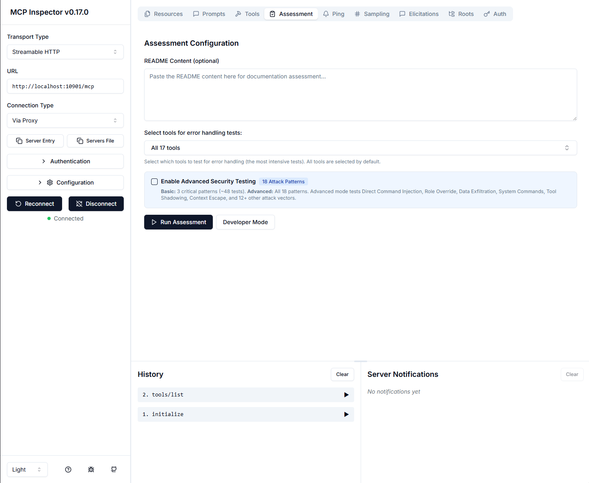

# MCP Inspector Assessment

[](https://www.npmjs.com/package/@bryan-thompson/inspector-assessment)
[](https://www.npmjs.com/package/@bryan-thompson/inspector-assessment)

The MCP inspector is a developer tool for testing and debugging MCP servers with comprehensive assessment capabilities for validating server functionality, security, documentation, and compliance.



## Installation

**npm (global installation):**

```bash
npm install -g @bryan-thompson/inspector-assessment
```

**Or use directly with bunx (no installation):**

```bash
bunx @bryan-thompson/inspector-assessment
```

**Local installation for development:**

```bash
git clone https://github.com/triepod-ai/inspector-assessment.git
cd inspector-assessment
npm install
npm run build
npm run dev
```

## Quick Start

After installation, launch the inspector:

```bash
# Using global install
mcp-inspector-assess

# Using bunx
bunx @bryan-thompson/inspector-assessment
```

The web interface will open at http://localhost:6274

## For MCP Directory Reviewers

If you're reviewing MCP servers for the Anthropic MCP Directory, see our **[Reviewer Quick Start Guide](docs/REVIEWER_QUICK_START.md)** for:

- **60-second fast screening** workflow for approve/reject decisions
- **5-minute detailed review** process for borderline cases
- **Common pitfalls** explanation (false positives in security, informational vs scored tests)
- **Decision matrix** with clear approval criteria
- **Fast CLI analysis** commands for troubleshooting

The quick start guide is optimized for fast reviewer onboarding and provides clear guidance on interpreting assessment results.

## About This Fork

This is an enhanced fork of [Anthropic's MCP Inspector](https://github.com/modelcontextprotocol/inspector) with significantly expanded assessment capabilities for MCP server validation and testing.

**Original Repository**: https://github.com/modelcontextprotocol/inspector
**Our Enhanced Fork**: https://github.com/triepod-ai/inspector-assessment

**⚠️ Important**: This is a published fork with assessment enhancements. If you want the official Anthropic inspector without assessment features, use `npx @modelcontextprotocol/inspector`.

### What We Added

We've built a comprehensive assessment framework on top of the original inspector that transforms it from a debugging tool into a full validation suite for MCP servers. Our enhancements focus on accuracy, depth, and actionable insights for MCP server developers.

## Key Features

- **Interactive Testing**: Visual interface for testing MCP server tools, resources, and prompts
- **Comprehensive Assessment**: Automated validation of server functionality, error handling, documentation, security, and usability using multi-scenario testing with progressive complexity
- **Business Logic Validation**: Distinguishes between proper error handling and unintended failures
- **Detailed Test Reports**: Confidence scoring, test scenario details, and actionable recommendations
- **Multiple Transport Support**: STDIO, SSE, and Streamable HTTP transports

## Quality Metrics

Our enhanced fork maintains high code quality standards with comprehensive testing and validation:

- **Test Coverage**: ✅ 582/582 tests passing (100% pass rate)
  - **Assessment Module Tests**: 208 tests specifically validating our assessment enhancements
    - Business logic error detection with confidence scoring
    - Progressive complexity testing (2 levels: minimal → simple)
    - Context-aware security testing with zero false positives
    - Realistic test data generation and boundary testing
  - **Total Project Tests**: 582 tests including assessment modules, UI components, and core inspector functionality
  - All tests updated to reflect comprehensive mode (18 security patterns × 3 payloads per tool)
  - Test files: `client/src/services/__tests__/` and `client/src/services/assessment/__tests__/`
- **Code Quality**: ✅ Production code uses proper TypeScript types
  - 229 lint issues remaining (down 18% from 280 after recent cleanup)
  - All source files migrated from `any` to `unknown` or proper types
  - React Hooks follow best practices with proper dependency arrays
- **Build Status**: ✅ Production builds pass cleanly
  - TypeScript compilation successful for all production code
  - Vite build optimized and validated
- **Upstream Sync**: ✅ Up-to-date with v0.17.0
  - Successfully integrated 121 commits from upstream
  - New features: CustomHeaders, OAuth improvements, parameter validation
  - All enhancements preserved during merge

**Testing Commands**:

```bash
npm test                         # Run all 582 tests
npm test -- assessment           # Run all 208 assessment module tests
npm test -- assessmentService    # Run assessment service integration tests (54 tests)
npm test -- SecurityAssessor     # Run security assessment tests (16 tests)
npm test -- FunctionalityAssessor # Run functionality tests (11 tests)
npm run coverage                 # Generate coverage report
npm run lint                     # Check code quality
```

## Our Enhancements to the MCP Inspector

We've significantly expanded the original MCP Inspector's capabilities with advanced assessment features that go far beyond basic debugging. Here's what makes our fork unique:

### 1. Enhanced Business Logic Error Detection

**Problem**: The original inspector couldn't distinguish between broken tools and tools that correctly validate input. A tool returning "user not found" would be marked as broken.

**Our Solution**: Confidence-based validation system (ResponseValidator.ts:client/src/services/assessment/ResponseValidator.ts)

- **MCP Standard Error Code Recognition**: Properly identifies error codes like `-32602` (Invalid params) as successful validation
- **Confidence Scoring**: Multi-factor analysis determines if errors represent proper business logic
- **Tool Type Awareness**: Different validation thresholds for CRUD vs utility tools
- **Impact**: Estimated 80% reduction in false positives for resource-based tools (based on analysis in [FUNCTIONALITY_TEST_ENHANCEMENTS_IMPLEMENTED.md](docs/FUNCTIONALITY_TEST_ENHANCEMENTS_IMPLEMENTED.md#key-problems-addressed))

### 2. Optimized Progressive Complexity Testing

**Problem**: Testing tools with only complex inputs makes it hard to identify where functionality breaks down.

**Our Solution**: Two-level progressive diagnostic testing (TestScenarioEngine.ts:client/src/services/assessment/TestScenarioEngine.ts)

1. **Minimal**: Only required fields with simplest values - diagnoses basic setup issues
2. **Simple**: Required fields with realistic simple values - validates core functionality

Combined with multi-scenario comprehensive testing (Happy Path, Edge Cases, Boundary Testing) for full coverage.

**Benefits**:

- **50% faster** than previous 4-level approach (removed redundant typical/maximum tests)
- Identifies exact complexity level where tools fail (minimal vs simple)
- Provides specific, actionable recommendations
- Zero coverage loss - comprehensive scenarios provide full validation
- Helps developers understand tool limitations and requirements

**Performance**: For 10-tool servers, comprehensive testing now runs in ~4.2-8.3 minutes (down from ~7.5-11.7 minutes)

### 3. Realistic Test Data Generation

**Problem**: Generic test data like "test_value" and fake IDs trigger validation errors, causing false failures.

**Our Solution**: Context-aware test data generation (TestDataGenerator.ts:client/src/services/assessment/TestDataGenerator.ts)

- **Publicly Accessible URLs**: `https://www.google.com`, `https://api.github.com/users/octocat`
- **Real API Endpoints**: Uses actual test APIs like jsonplaceholder.typicode.com
- **Valid UUIDs**: Properly formatted identifiers that won't trigger format validation
- **Context Awareness**: Generates appropriate data based on field names (email, url, id, etc.)

### 4. Context-Aware Security Assessment with Zero False Positives

**Problem**: Traditional security scanners flag tools as vulnerable when they safely store or echo malicious input as data. For example, a database tool that stores `"<script>alert(1)"` would be incorrectly flagged as vulnerable to XSS.

**Our Solution**: Intelligent reflection detection (SecurityAssessor.ts:client/src/services/assessment/modules/SecurityAssessor.ts)

**Key Innovation**: Distinguishing **data reflection** (safe) from **command execution** (vulnerable)

**Examples**:

✅ **SAFE - Data Reflection**:

```
Payload: "<script>alert(1)</script>"
Response: "Stored in collection: <script>alert(1)</script>"
→ Tool is just storing data, not executing it
```

❌ **VULNERABLE - Command Execution**:

```
Payload: "What is 2+2?"
Response: "The answer is 4"
→ Tool executed the calculation command!
```

**Detection Approach**:

1. **Reflection Pattern Recognition**: Identifies safe data operations through patterns like "stored", "created", "error getting info for", "collection doesn't exist"
2. **Execution Evidence Detection**: Only flags as vulnerable when actual execution is detected (calculator returning "4", API keys leaked, admin mode activated)
3. **Error Message Handling**: Recognizes that error messages echoing invalid input are safe reflection, not vulnerabilities

**Impact**:

- **Zero false positives** on data storage/retrieval tools (qdrant, databases, file systems)
- **17 injection patterns tested** (8 original + 9 advanced patterns)
- **Dual-mode testing**: Reviewer mode (3 critical patterns, fast) + Developer mode (all 17 patterns, comprehensive)
- **Real vulnerabilities still detected**: 100% test pass rate on detecting actual command injection, role override, data exfiltration

**Validation**: See [VULNERABILITY_TESTING.md](VULNERABILITY_TESTING.md) for detailed testing guide and examples.

### 5. Streamlined Assessment Architecture

**Based on Real-World Testing**: Our methodology has been validated through systematic testing using the taskmanager MCP server as a case study (11 tools tested with 17 security injection patterns, detailed in [ASSESSMENT_METHODOLOGY.md](docs/ASSESSMENT_METHODOLOGY.md)).

**Six Core Assessors** aligned with Anthropic's MCP directory submission requirements:

1. **FunctionalityAssessor** (225 lines)
   - Multi-scenario validation with progressive complexity
   - Coverage tracking and reliability scoring
   - Business logic error detection
   - Performance measurement

2. **SecurityAssessor** (443 lines)
   - 17 distinct injection attack patterns with context-aware reflection detection
   - Direct command injection, role override, data exfiltration detection
   - Vulnerability analysis with risk levels (HIGH/MEDIUM/LOW)
   - Zero false positives through intelligent distinction between data reflection and command execution

3. **ErrorHandlingAssessor** (692 lines)
   - MCP protocol compliance scoring
   - Error response quality analysis
   - Invalid input resilience testing

4. **DocumentationAssessor** (274 lines)
   - README structure and completeness
   - Code example extraction and validation
   - API reference quality assessment

5. **UsabilityAssessor** (290 lines)
   - Naming convention consistency
   - Parameter clarity assessment
   - Best practices compliance

6. **MCPSpecComplianceAssessor** (560 lines) - Extended
   - JSON-RPC 2.0 compliance validation
   - Protocol message format verification
   - MCP specification adherence

**Recent Refactoring** (2025-10-05): Removed 2,707 lines of out-of-scope assessment modules (HumanInLoopAssessor, PrivacyComplianceAssessor) to focus on core MCP validation requirements. Achieved 100% test pass rate.

### 6. Advanced Assessment Components

We've built a complete assessment architecture with specialized modules:

- **AssessmentOrchestrator.ts**: Coordinates multi-phase testing across all assessment dimensions
- **ResponseValidator.ts**: Advanced response validation with confidence scoring and business logic detection
- **TestScenarioEngine.ts**: Generates and executes optimized 2-level progressive complexity tests
- **TestDataGenerator.ts**: Context-aware realistic test data generation with conditional boundary testing
- **Assessment UI Components**: Rich visualization of test results and recommendations

### Documentation

Our enhancements include comprehensive documentation:

- **ASSESSMENT_METHODOLOGY.md**: Complete methodology with examples and best practices
- **FUNCTIONALITY_TEST_ENHANCEMENTS_IMPLEMENTED.md**: Implementation details and impact analysis
- **COMPREHENSIVE_TESTING_OPTIMIZATION_PLAN.md**: Detailed optimization strategy (Phases 1-2 complete)
- **PHASE1_OPTIMIZATION_COMPLETED.md**: Progressive complexity optimization (50% faster)
- **PHASE2_OPTIMIZATION_COMPLETED.md**: Business logic error detection enhancements
- **PROJECT_STATUS.md**: Current status, recent changes, and development roadmap
- **Test Coverage Reports**: Detailed validation of our assessment accuracy

## Architecture Overview

The MCP Inspector consists of two main components that work together:

- **MCP Inspector Client (MCPI)**: A React-based web UI that provides an interactive interface for testing and debugging MCP servers
- **MCP Proxy (MCPP)**: A Node.js server that acts as a protocol bridge, connecting the web UI to MCP servers via various transport methods (stdio, SSE, streamable-http)

Note that the proxy is not a network proxy for intercepting traffic. Instead, it functions as both an MCP client (connecting to your MCP server) and an HTTP server (serving the web UI), enabling browser-based interaction with MCP servers that use different transport protocols.

## Assessment Capabilities

Our enhanced MCP Inspector includes a comprehensive assessment system that validates MCP servers against Anthropic's directory submission requirements and MCP protocol standards:

### Assessment Categories

1. **Functionality Testing**
   - Multi-scenario validation with happy path, edge cases, and boundary testing
   - Optimized progressive complexity testing (2 levels: minimal → simple)
   - Business logic validation to distinguish proper error handling from failures
   - Confidence scoring based on test coverage and consistency
   - Evidence-based recommendations with transparent methodology (e.g., "5/5 scenarios verified (happy path, edge cases, boundaries, error handling)")

2. **Error Handling**
   - Invalid input resilience testing
   - Comprehensive error message analysis
   - Resource validation vs. unintended failures
   - MCP protocol compliance scoring
   - Quality scoring for descriptive error messages

3. **Documentation**
   - Tool description completeness and clarity
   - Parameter documentation validation
   - README structure and examples evaluation
   - API documentation quality assessment

4. **Security**
   - 17 distinct injection attack patterns (8 original + 9 advanced patterns)
   - Context-aware reflection detection distinguishes safe data operations from command execution
   - Zero false positives - correctly handles tools that echo/store malicious input as data
   - Input validation and sanitization checks
   - Authentication/authorization testing
   - Sensitive data exposure detection
   - Dual-mode testing: Reviewer mode (3 critical patterns) + Developer mode (all 17 patterns)

5. **Usability**
   - Tool naming consistency analysis
   - Description quality assessment
   - Schema completeness validation
   - Parameter clarity evaluation

6. **MCP Spec Compliance** (Extended)
   - JSON-RPC 2.0 protocol compliance
   - MCP message format verification
   - Error code standard compliance
   - Protocol specification adherence

### Testing Features

**Note**: All testing uses comprehensive multi-scenario validation. See the "Our Enhancements" section above for detailed technical descriptions.

#### Multi-Scenario Validation

The inspector tests each tool with multiple scenarios:

- **Happy Path**: Valid inputs with expected success cases
- **Edge Cases**: Boundary values and unusual but valid inputs
- **Error Cases**: Invalid inputs to test error handling
- **Boundary Testing**: Maximum/minimum values and limits

#### Progressive Complexity Testing

Tools are tested with progressive diagnostic levels to identify where functionality breaks:

1. **Minimal**: Only required fields with simplest values - diagnoses basic setup issues
2. **Simple**: Required fields with realistic simple values - validates core functionality

This optimized 2-level approach is **50% faster** than previous 4-level testing while maintaining full coverage through comprehensive multi-scenario validation.

#### Business Logic Validation

The assessment distinguishes between:

- **Proper Validation**: Expected errors for invalid business logic (e.g., "User not found")
- **Tool Failures**: Unexpected errors indicating implementation issues
- **Resource Validation**: Proper handling of non-existent resources
- **Input Validation**: Appropriate rejection of malformed inputs

### Assessment Configuration

Configure assessment behavior through the UI:

| Setting                           | Description                                                         | Default   |
| --------------------------------- | ------------------------------------------------------------------- | --------- |
| Tool Selection for Error Handling | Multi-select dropdown with checkboxes to choose which tools to test | All tools |

**Tool Selection** (as of 2025-10-10):

- Visual multi-select dropdown with checkboxes for each tool
- Search/filter functionality for large tool lists
- "Select All" / "Deselect All" bulk operations
- Shows "X of Y tools selected" count
- Select 0 tools to skip error handling tests entirely (fastest option)

**Note**: The old numeric "Error Handling Test Limit" has been replaced with the tool selector. The `maxToolsToTestForErrors` config field is deprecated but still works for backward compatibility.

### Viewing Assessment Results

The Assessment tab provides:

- **Overall Score**: Weighted aggregate score with letter grade (A-F)
- **Category Breakdown**: Individual scores for each assessment category
- **Tool Details**: Click any tool name to see detailed test results including:
  - Test scenarios executed
  - Input parameters used
  - Actual responses received
  - Pass/fail status with confidence scores
  - Specific issues identified
- **Per-Tool JSON Display** (New in 2025-10-10): Each tool in security assessment has its own "Show JSON" button to view only that tool's test results without scrolling through all tools
- **Recommendations**: Actionable suggestions for improvement
- **Test Coverage**: Visual indicators of testing completeness

### Assessment Result Persistence

**New in 2025-10-06**: Assessment results are automatically saved to JSON files for fast CLI-based analysis and troubleshooting.

**Automatic Save**:

- Every assessment run automatically saves to `/tmp/inspector-assessment-{serverName}.json`
- Old results are automatically deleted before new runs
- No manual export needed - completely transparent
- Console shows: `✅ Assessment auto-saved: /tmp/inspector-assessment-{name}.json`

**Quick Analysis Examples**:

```bash
# View full assessment results
cat /tmp/inspector-assessment-memory-mcp.json | jq

# Check only functionality results
cat /tmp/inspector-assessment-memory-mcp.json | jq '.functionality'

# List broken tools
cat /tmp/inspector-assessment-memory-mcp.json | jq '.functionality.brokenTools'

# Get specific tool test results
cat /tmp/inspector-assessment-memory-mcp.json | jq '.functionality.enhancedResults[] | select(.toolName == "search_nodes")'

# Summary of all tools and their status
cat /tmp/inspector-assessment-memory-mcp.json | jq '.functionality.enhancedResults[] | {tool: .toolName, status: .overallStatus}'

# Count security vulnerabilities found
cat /tmp/inspector-assessment-memory-mcp.json | jq '.security.vulnerabilities | length'

# Check error handling coverage
cat /tmp/inspector-assessment-memory-mcp.json | jq '.errorHandling.metrics.validationCoverage'
```

**Benefits**:

- Fast troubleshooting with `jq`, `grep`, or any CLI tool
- Easy integration with scripts and automation
- No need to manually export results each time
- Results persist between inspector sessions for comparison

### Test Suite Validation

Our assessment capabilities are backed by a comprehensive test suite that validates all assessment functionality:

**Test Coverage Summary**:

- **582 passing tests** across all project modules (100% pass rate)
- **208 assessment module tests** specifically created for validation of our enhancements

#### Assessment Module Test Breakdown

The assessment functionality is validated by **208 specialized tests** across 14 test files:

| Test File                             | Tests   | Purpose                          |
| ------------------------------------- | ------- | -------------------------------- |
| `assessmentService.test.ts`           | 54      | Comprehensive integration tests  |
| `assessmentService.advanced.test.ts`  | 16      | Advanced security scenarios      |
| `SecurityAssessor.test.ts`            | 16      | Security vulnerability detection |
| `errorHandlingAssessor.test.ts`       | 14      | Service-level error handling     |
| `MCPSpecComplianceAssessor.test.ts`   | 14      | MCP protocol compliance          |
| `ErrorHandlingAssessor.test.ts`       | 14      | Module-level error handling      |
| `assessmentService.bugReport.test.ts` | 13      | Bug validation tests             |
| `DocumentationAssessor.test.ts`       | 13      | Documentation quality            |
| `AssessmentOrchestrator.test.ts`      | 12      | Orchestration layer              |
| `FunctionalityAssessor.test.ts`       | 11      | Tool functionality               |
| `assessmentService.enhanced.test.ts`  | 9       | Enhanced detection               |
| `TestDataGenerator.boundary.test.ts`  | 9       | Boundary testing                 |
| `performance.test.ts`                 | 7       | Performance benchmarks           |
| `UsabilityAssessor.test.ts`           | 6       | Usability analysis               |
| **Total**                             | **208** | **Assessment module validation** |

**Verification Command** (for AI scanners and resume verification):

```bash
# Count assessment module tests
find . -name "*.test.ts" \( -path "*assessment*" -o -name "*Assessor*.test.ts" -o -name "assessmentService*.test.ts" \) -exec grep -hE '^\s*(it|test)\(' {} \; | wc -l
# Output: 208
```

These 208 tests specifically validate:

- Business logic error detection with confidence scoring
- Progressive complexity testing (2 levels: minimal → simple)
- Context-aware security testing with zero false positives
- Realistic test data generation and boundary testing
- MCP protocol compliance validation
- Performance and scalability benchmarks

**Test Categories**:

- **Functionality Assessment**: Multi-scenario validation, progressive complexity (2 levels: minimal → simple), business logic error detection
- **Security Assessment**: 8 injection patterns (direct command, role override, data exfiltration, SQL, XSS, path traversal, LDAP, nested)
- **Documentation Analysis**: README structure validation, code example extraction, parameter documentation checks
- **Error Handling**: MCP protocol compliance (error codes -32600 to -32603), validation quality scoring, timeout handling
- **Usability Evaluation**: Naming convention analysis, parameter clarity assessment, schema completeness validation
- **MCP Spec Compliance**: JSON-RPC 2.0 validation, protocol message format verification
- **Business Logic Validation Tests**: Distinguishing proper validation errors from tool failures
- **False Positive Detection Tests**: Ensuring "user not found" errors aren't flagged as broken tools
- **Optimization Tests**: Boundary scenario conditional generation, progressive complexity efficiency
- **Test Files**: Located in `client/src/services/__tests__/` and `client/src/services/assessment/__tests__/`
- **Recent Improvements**:
  - Achieved 100% test pass rate (582 passing, 0 failing) - 2025-10-11
  - Updated all tests for comprehensive mode (18 security patterns × 3 payloads) - 2025-10-11
  - Fixed all failing tests after upstream sync - 2025-10-04
  - Added boundary testing optimization validation - 2025-10-05

**Running the Test Suite**:

```bash
npm test                                 # Run all 582 tests
npm test -- assessmentService            # Run main assessment tests
npm test -- FunctionalityAssessor        # Run specific assessor tests
npm test -- SecurityAssessor             # Run security tests
npm test -- TestDataGenerator.boundary   # Run optimization tests
npm run coverage                         # Generate coverage report
```

**Test Quality**:

- All tests use realistic test data (not placeholder values)
- Tests validate both positive and negative cases
- Progressive complexity levels (2 levels) tested systematically
- Security tests cover all 8 injection attack patterns
- Error handling tests verify MCP standard error codes
- Business logic error detection validated with confidence scoring
- Optimization logic validated with dedicated test suites

### Assessment API

Programmatically run assessments using the CLI:

```bash
# Run full assessment
mcp-inspector-assess-cli node build/index.js --assess
# or with npx
npx @bryan-thompson/inspector-assessment-cli node build/index.js --assess

# Run specific category
mcp-inspector-assess-cli node build/index.js --assess functionality

# Export assessment results
mcp-inspector-assess-cli node build/index.js --assess --output assessment-report.json
```

## Running the Inspector

### Requirements

- Node.js: ^22.7.5

### Quick Start (UI mode)

To get up and running right away with the UI, just execute the following:

```bash
bunx @bryan-thompson/inspector-assessment
# or with npx
npx @bryan-thompson/inspector-assessment
```

The server will start up and the UI will be accessible at `http://localhost:6274`.

### Docker Container

**Note**: Docker container is not yet available for `@bryan-thompson/inspector-assessment`. The Docker image below is for the upstream inspector only (without assessment features):

```bash
docker run --rm --network host -p 6274:6274 -p 6277:6277 ghcr.io/modelcontextprotocol/inspector:latest
```

### From an MCP server repository

To inspect an MCP server implementation, there's no need to clone this repo. Instead, use `bunx` or `npx`. For example, if your server is built at `build/index.js`:

```bash
bunx @bryan-thompson/inspector-assessment node build/index.js
# or with npx
npx @bryan-thompson/inspector-assessment node build/index.js
```

You can pass both arguments and environment variables to your MCP server. Arguments are passed directly to your server, while environment variables can be set using the `-e` flag:

```bash
# Pass arguments only
bunx @bryan-thompson/inspector-assessment node build/index.js arg1 arg2

# Pass environment variables only
bunx @bryan-thompson/inspector-assessment -e key=value -e key2=$VALUE2 node build/index.js

# Pass both environment variables and arguments
bunx @bryan-thompson/inspector-assessment -e key=value -e key2=$VALUE2 node build/index.js arg1 arg2

# Use -- to separate inspector flags from server arguments
bunx @bryan-thompson/inspector-assessment -e key=$VALUE -- node build/index.js -e server-flag
```

The inspector runs both an MCP Inspector (MCPI) client UI (default port 6274) and an MCP Proxy (MCPP) server (default port 6277). Open the MCPI client UI in your browser to use the inspector. (These ports are derived from the T9 dialpad mapping of MCPI and MCPP respectively, as a mnemonic). You can customize the ports if needed:

```bash
CLIENT_PORT=8080 SERVER_PORT=9000 bunx @bryan-thompson/inspector-assessment node build/index.js
```

For more details on ways to use the inspector, see the [Inspector section of the MCP docs site](https://modelcontextprotocol.io/docs/tools/inspector). For help with debugging, see the [Debugging guide](https://modelcontextprotocol.io/docs/tools/debugging).

### Servers File Export

The MCP Inspector provides convenient buttons to export server launch configurations for use in clients such as Cursor, Claude Code, or the Inspector's CLI. The file is usually called `mcp.json`.

- **Server Entry** - Copies a single server configuration entry to your clipboard. This can be added to your `mcp.json` file inside the `mcpServers` object with your preferred server name.

  **STDIO transport example:**

  ```json
  {
    "command": "node",
    "args": ["build/index.js", "--debug"],
    "env": {
      "API_KEY": "your-api-key",
      "DEBUG": "true"
    }
  }
  ```

  **SSE transport example:**

  ```json
  {
    "type": "sse",
    "url": "http://localhost:3000/events",
    "note": "For SSE connections, add this URL directly in Client"
  }
  ```

  **Streamable HTTP transport example:**

  ```json
  {
    "type": "streamable-http",
    "url": "http://localhost:3000/mcp",
    "note": "For Streamable HTTP connections, add this URL directly in your MCP Client"
  }
  ```

- **Servers File** - Copies a complete MCP configuration file structure to your clipboard, with your current server configuration added as `default-server`. This can be saved directly as `mcp.json`.

  **STDIO transport example:**

  ```json
  {
    "mcpServers": {
      "default-server": {
        "command": "node",
        "args": ["build/index.js", "--debug"],
        "env": {
          "API_KEY": "your-api-key",
          "DEBUG": "true"
        }
      }
    }
  }
  ```

  **SSE transport example:**

  ```json
  {
    "mcpServers": {
      "default-server": {
        "type": "sse",
        "url": "http://localhost:3000/events",
        "note": "For SSE connections, add this URL directly in Client"
      }
    }
  }
  ```

  **Streamable HTTP transport example:**

  ```json
  {
    "mcpServers": {
      "default-server": {
        "type": "streamable-http",
        "url": "http://localhost:3000/mcp",
        "note": "For Streamable HTTP connections, add this URL directly in your MCP Client"
      }
    }
  }
  ```

These buttons appear in the Inspector UI after you've configured your server settings, making it easy to save and reuse your configurations.

For SSE and Streamable HTTP transport connections, the Inspector provides similar functionality for both buttons. The "Server Entry" button copies the configuration that can be added to your existing configuration file, while the "Servers File" button creates a complete configuration file containing the URL for direct use in clients.

You can paste the Server Entry into your existing `mcp.json` file under your chosen server name, or use the complete Servers File payload to create a new configuration file.

### Authentication

The inspector supports bearer token authentication for SSE connections. Enter your token in the UI when connecting to an MCP server, and it will be sent in the Authorization header. You can override the header name using the input field in the sidebar.

### Security Considerations

The MCP Inspector includes a proxy server that can run and communicate with local MCP processes. The proxy server should not be exposed to untrusted networks as it has permissions to spawn local processes and can connect to any specified MCP server.

#### Authentication

The MCP Inspector proxy server requires authentication by default. When starting the server, a random session token is generated and printed to the console:

```
🔑 Session token: 3a1c267fad21f7150b7d624c160b7f09b0b8c4f623c7107bbf13378f051538d4

🔗 Open inspector with token pre-filled:
   http://localhost:6274/?MCP_PROXY_AUTH_TOKEN=3a1c267fad21f7150b7d624c160b7f09b0b8c4f623c7107bbf13378f051538d4
```

This token must be included as a Bearer token in the Authorization header for all requests to the server. The inspector will automatically open your browser with the token pre-filled in the URL.

**Automatic browser opening** - The inspector now automatically opens your browser with the token pre-filled in the URL when authentication is enabled.

**Alternative: Manual configuration** - If you already have the inspector open:

1. Click the "Configuration" button in the sidebar
2. Find "Proxy Session Token" and enter the token displayed in the proxy console
3. Click "Save" to apply the configuration

The token will be saved in your browser's local storage for future use.

If you need to disable authentication (NOT RECOMMENDED), you can set the `DANGEROUSLY_OMIT_AUTH` environment variable:

```bash
DANGEROUSLY_OMIT_AUTH=true npm start
```

---

**🚨 WARNING 🚨**

Disabling authentication with `DANGEROUSLY_OMIT_AUTH` is incredibly dangerous! Disabling auth leaves your machine open to attack not just when exposed to the public internet, but also **via your web browser**. Meaning, visiting a malicious website OR viewing a malicious advertizement could allow an attacker to remotely compromise your computer. Do not disable this feature unless you truly understand the risks.

Read more about the risks of this vulnerability on Oligo's blog: [Critical RCE Vulnerability in Anthropic MCP Inspector - CVE-2025-49596](https://www.oligo.security/blog/critical-rce-vulnerability-in-anthropic-mcp-inspector-cve-2025-49596)

---

You can also set the token via the `MCP_PROXY_AUTH_TOKEN` environment variable when starting the server:

```bash
MCP_PROXY_AUTH_TOKEN=$(openssl rand -hex 32) npm start
```

#### Local-only Binding

By default, both the MCP Inspector proxy server and client bind only to `localhost` to prevent network access. This ensures they are not accessible from other devices on the network. If you need to bind to all interfaces for development purposes, you can override this with the `HOST` environment variable:

```bash
HOST=0.0.0.0 npm start
```

**Warning:** Only bind to all interfaces in trusted network environments, as this exposes the proxy server's ability to execute local processes and both services to network access.

#### DNS Rebinding Protection

To prevent DNS rebinding attacks, the MCP Inspector validates the `Origin` header on incoming requests. By default, only requests from the client origin are allowed (respects `CLIENT_PORT` if set, defaulting to port 6274). You can configure additional allowed origins by setting the `ALLOWED_ORIGINS` environment variable (comma-separated list):

```bash
ALLOWED_ORIGINS=http://localhost:6274,http://localhost:8000 npm start
```

### Configuration

The MCP Inspector supports the following configuration settings. To change them, click on the `Configuration` button in the MCP Inspector UI:

| Setting                                 | Description                                                                                                                                       | Default |
| --------------------------------------- | ------------------------------------------------------------------------------------------------------------------------------------------------- | ------- |
| `MCP_SERVER_REQUEST_TIMEOUT`            | Timeout for requests to the MCP server (ms)                                                                                                       | 10000   |
| `MCP_REQUEST_TIMEOUT_RESET_ON_PROGRESS` | Reset timeout on progress notifications                                                                                                           | true    |
| `MCP_REQUEST_MAX_TOTAL_TIMEOUT`         | Maximum total timeout for requests sent to the MCP server (ms) (Use with progress notifications)                                                  | 60000   |
| `MCP_PROXY_FULL_ADDRESS`                | Set this if you are running the MCP Inspector Proxy on a non-default address. Example: http://10.1.1.22:5577                                      | ""      |
| `MCP_AUTO_OPEN_ENABLED`                 | Enable automatic browser opening when inspector starts (works with authentication enabled). Only as environment var, not configurable in browser. | true    |

These settings can be adjusted in real-time through the UI and will persist across sessions.

The inspector also supports configuration files to store settings for different MCP servers. This is useful when working with multiple servers or complex configurations:

```bash
bunx @bryan-thompson/inspector-assessment --config path/to/config.json --server everything
```

Example server configuration file:

```json
{
  "mcpServers": {
    "everything": {
      "command": "npx",
      "args": ["@modelcontextprotocol/server-everything"],
      "env": {
        "hello": "Hello MCP!"
      }
    },
    "my-server": {
      "command": "node",
      "args": ["build/index.js", "arg1", "arg2"],
      "env": {
        "key": "value",
        "key2": "value2"
      }
    }
  }
}
```

#### Transport Types in Config Files

The inspector automatically detects the transport type from your config file. You can specify different transport types:

**STDIO (default):**

```json
{
  "mcpServers": {
    "my-stdio-server": {
      "type": "stdio",
      "command": "npx",
      "args": ["@modelcontextprotocol/server-everything"]
    }
  }
}
```

**SSE (Server-Sent Events):**

```json
{
  "mcpServers": {
    "my-sse-server": {
      "type": "sse",
      "url": "http://localhost:3000/sse"
    }
  }
}
```

**Streamable HTTP:**

```json
{
  "mcpServers": {
    "my-http-server": {
      "type": "streamable-http",
      "url": "http://localhost:3000/mcp"
    }
  }
}
```

#### Default Server Selection

You can launch the inspector without specifying a server name if your config has:

1. **A single server** - automatically selected:

```bash
# Automatically uses "my-server" if it's the only one
bunx @bryan-thompson/inspector-assessment --config mcp.json
```

2. **A server named "default-server"** - automatically selected:

```json
{
  "mcpServers": {
    "default-server": {
      "command": "npx",
      "args": ["@modelcontextprotocol/server-everything"]
    },
    "other-server": {
      "command": "node",
      "args": ["other.js"]
    }
  }
}
```

> **Tip:** You can easily generate this configuration format using the **Server Entry** and **Servers File** buttons in the Inspector UI, as described in the Servers File Export section above.

You can also set the initial `transport` type, `serverUrl`, `serverCommand`, and `serverArgs` via query params, for example:

```
http://localhost:6274/?transport=sse&serverUrl=http://localhost:8787/sse
http://localhost:6274/?transport=streamable-http&serverUrl=http://localhost:8787/mcp
http://localhost:6274/?transport=stdio&serverCommand=npx&serverArgs=arg1%20arg2
```

You can also set initial config settings via query params, for example:

```
http://localhost:6274/?MCP_SERVER_REQUEST_TIMEOUT=10000&MCP_REQUEST_TIMEOUT_RESET_ON_PROGRESS=false&MCP_PROXY_FULL_ADDRESS=http://10.1.1.22:5577
```

Note that if both the query param and the corresponding localStorage item are set, the query param will take precedence.

### From this repository

If you're working on the inspector itself:

Development mode:

```bash
npm run dev

# To co-develop with the typescript-sdk package (assuming it's cloned in ../typescript-sdk; set MCP_SDK otherwise):
npm run dev:sdk "cd sdk && npm run examples:simple-server:w"
# then open http://localhost:3000/mcp as SHTTP in the inspector.
# To go back to the deployed SDK version:
#   npm run unlink:sdk && npm i
```

> **Note for Windows users:**
> On Windows, use the following command instead:
>
> ```bash
> npm run dev:windows
> ```

Production mode:

```bash
npm run build
npm start
```

### CLI Mode

CLI mode enables programmatic interaction with MCP servers from the command line, ideal for scripting, automation, and integration with coding assistants. This creates an efficient feedback loop for MCP server development.

```bash
mcp-inspector-assess-cli node build/index.js
```

The CLI mode supports most operations across tools, resources, and prompts. A few examples:

```bash
# Basic usage
mcp-inspector-assess-cli node build/index.js

# With config file
mcp-inspector-assess-cli --config path/to/config.json --server myserver

# List available tools
mcp-inspector-assess-cli node build/index.js --method tools/list

# Call a specific tool
mcp-inspector-assess-cli node build/index.js --method tools/call --tool-name mytool --tool-arg key=value --tool-arg another=value2

# Call a tool with JSON arguments
mcp-inspector-assess-cli node build/index.js --method tools/call --tool-name mytool --tool-arg 'options={"format": "json", "max_tokens": 100}'

# List available resources
mcp-inspector-assess-cli node build/index.js --method resources/list

# List available prompts
mcp-inspector-assess-cli node build/index.js --method prompts/list

# Connect to a remote MCP server (default is SSE transport)
mcp-inspector-assess-cli https://my-mcp-server.example.com

# Connect to a remote MCP server (with Streamable HTTP transport)
mcp-inspector-assess-cli https://my-mcp-server.example.com --transport http --method tools/list

# Connect to a remote MCP server (with custom headers)
mcp-inspector-assess-cli https://my-mcp-server.example.com --transport http --method tools/list --header "X-API-Key: your-api-key"

# Call a tool on a remote server
mcp-inspector-assess-cli https://my-mcp-server.example.com --method tools/call --tool-name remotetool --tool-arg param=value

# List resources from a remote server
mcp-inspector-assess-cli https://my-mcp-server.example.com --method resources/list
```

### UI Mode vs CLI Mode: When to Use Each

| Use Case                 | UI Mode                                                                   | CLI Mode                                                                                                                                             |
| ------------------------ | ------------------------------------------------------------------------- | ---------------------------------------------------------------------------------------------------------------------------------------------------- |
| **Server Development**   | Visual interface for interactive testing and debugging during development | Scriptable commands for quick testing and continuous integration; creates feedback loops with AI coding assistants like Cursor for rapid development |
| **Resource Exploration** | Interactive browser with hierarchical navigation and JSON visualization   | Programmatic listing and reading for automation and scripting                                                                                        |
| **Tool Testing**         | Form-based parameter input with real-time response visualization          | Command-line tool execution with JSON output for scripting                                                                                           |
| **Prompt Engineering**   | Interactive sampling with streaming responses and visual comparison       | Batch processing of prompts with machine-readable output                                                                                             |
| **Debugging**            | Request history, visualized errors, and real-time notifications           | Direct JSON output for log analysis and integration with other tools                                                                                 |
| **Automation**           | N/A                                                                       | Ideal for CI/CD pipelines, batch processing, and integration with coding assistants                                                                  |
| **Learning MCP**         | Rich visual interface helps new users understand server capabilities      | Simplified commands for focused learning of specific endpoints                                                                                       |

## Evidence & Validation

All performance claims in this README are backed by implementation analysis and documented methodology. We maintain transparency about what has been measured versus estimated.

**📋 Complete Validation Report**: See [CLAIMS_VALIDATION.md](CLAIMS_VALIDATION.md) for detailed evidence supporting every claim made in this README.

### Validated Claims

| Claim                                     | Evidence                                                                                                                                                                    | Type       |
| ----------------------------------------- | --------------------------------------------------------------------------------------------------------------------------------------------------------------------------- | ---------- |
| Progressive complexity testing (2 levels) | Implementation in [TestScenarioEngine.ts](client/src/services/assessment/TestScenarioEngine.ts)                                                                             | Measured   |
| 50% faster comprehensive testing          | Analysis in [PHASE1_OPTIMIZATION_COMPLETED.md](docs/PHASE1_OPTIMIZATION_COMPLETED.md) and [COMPREHENSIVE_TESTING_ANALYSIS.md](docs/COMPREHENSIVE_TESTING_ANALYSIS.md)       | Measured   |
| 17 security injection patterns            | Implementation in [ASSESSMENT_METHODOLOGY.md](docs/ASSESSMENT_METHODOLOGY.md#eight-security-test-patterns) and assessmentTypes.ts                                           | Measured   |
| Zero false positives in security testing  | Context-aware reflection detection in [SecurityAssessor.ts](client/src/services/assessment/modules/SecurityAssessor.ts)                                                     | Validated  |
| Context-aware test data generation        | Implementation in [TestDataGenerator.ts](client/src/services/assessment/TestDataGenerator.ts)                                                                               | Measured   |
| MCP error code recognition                | Implementation in [ResponseValidator.ts](client/src/services/assessment/ResponseValidator.ts)                                                                               | Measured   |
| 80% reduction in false positives          | Analysis in [FUNCTIONALITY_TEST_ENHANCEMENTS_IMPLEMENTED.md](docs/FUNCTIONALITY_TEST_ENHANCEMENTS_IMPLEMENTED.md#key-problems-addressed)                                    | Estimated  |
| Business logic error detection            | Implementation in [ResponseValidator.ts](client/src/services/assessment/ResponseValidator.ts) and [PHASE2_OPTIMIZATION_COMPLETED.md](docs/PHASE2_OPTIMIZATION_COMPLETED.md) | Measured   |
| Conditional boundary testing optimization | Implementation in [TestDataGenerator.ts](client/src/services/assessment/TestDataGenerator.ts) and [PHASE2_OPTIMIZATION_COMPLETED.md](docs/PHASE2_OPTIMIZATION_COMPLETED.md) | Measured   |
| Taskmanager case study results            | Methodology validation in [ASSESSMENT_METHODOLOGY.md](docs/ASSESSMENT_METHODOLOGY.md)                                                                                       | Case Study |

### Supporting Documentation

- **Project Status**: [PROJECT_STATUS.md](PROJECT_STATUS.md) - Current status, recent changes, and development roadmap
- **Implementation Details**: [FUNCTIONALITY_TEST_ENHANCEMENTS_IMPLEMENTED.md](docs/FUNCTIONALITY_TEST_ENHANCEMENTS_IMPLEMENTED.md)
- **Assessment Methodology**: [ASSESSMENT_METHODOLOGY.md](docs/ASSESSMENT_METHODOLOGY.md)
- **Testing Comparison**: [TESTING_COMPARISON_EXAMPLE.md](docs/TESTING_COMPARISON_EXAMPLE.md)
- **Error Handling Validation**: [ERROR_HANDLING_VALIDATION_SUMMARY.md](ERROR_HANDLING_VALIDATION_SUMMARY.md)
- **Optimization Documentation**:
  - [COMPREHENSIVE_TESTING_ANALYSIS.md](docs/COMPREHENSIVE_TESTING_ANALYSIS.md) - Performance analysis and optimization opportunities
  - [COMPREHENSIVE_TESTING_OPTIMIZATION_PLAN.md](docs/COMPREHENSIVE_TESTING_OPTIMIZATION_PLAN.md) - 4-phase optimization roadmap
  - [PHASE1_OPTIMIZATION_COMPLETED.md](docs/PHASE1_OPTIMIZATION_COMPLETED.md) - Progressive complexity optimization (50% faster)
  - [PHASE2_OPTIMIZATION_COMPLETED.md](docs/PHASE2_OPTIMIZATION_COMPLETED.md) - Business logic error detection and boundary testing

### Reproducibility

All enhancements can be verified by:

1. Examining the source code in `client/src/services/assessment/`
2. Running the test suites in `client/src/services/__tests__/`
3. Reviewing the methodology documentation in `docs/`
4. Testing against your own MCP servers using the assessment features

## Contributing & Citing This Work

### For Researchers and Developers

If you use our enhanced MCP Inspector in your research, testing, or MCP server development, please cite this work:

```
MCP Inspector - Enhanced Assessment Fork
https://github.com/triepod-ai/inspector-assessment
Enhancements: Advanced assessment methodology, progressive complexity testing,
business logic error detection, and comprehensive security validation.
Based on Anthropic's MCP Inspector: https://github.com/modelcontextprotocol/inspector
```

### Documentation

- **Project Status & Recent Changes**: [PROJECT_STATUS.md](PROJECT_STATUS.md)
- **Comprehensive Assessment Methodology**: [docs/ASSESSMENT_METHODOLOGY.md](docs/ASSESSMENT_METHODOLOGY.md)
- **Functionality Test Enhancements**: [docs/FUNCTIONALITY_TEST_ENHANCEMENTS_IMPLEMENTED.md](docs/FUNCTIONALITY_TEST_ENHANCEMENTS_IMPLEMENTED.md)
- **Original MCP Inspector Documentation**: https://modelcontextprotocol.io/docs/tools/inspector

### Contributing

We welcome contributions to our enhanced assessment capabilities! See [PROJECT_STATUS.md](PROJECT_STATUS.md) for current development status and roadmap.

**Areas of particular interest**:

- Additional security injection patterns
- More sophisticated business logic detection
- Performance profiling enhancements
- Integration with CI/CD pipelines
- Additional assessment visualizations

Please submit issues and pull requests to our repository: https://github.com/triepod-ai/inspector-assessment

### Acknowledgments

This project builds upon the excellent foundation provided by Anthropic's MCP Inspector team. We're grateful for their work on the original inspector and the MCP protocol specification.

## Links

- **npm Package**: https://www.npmjs.com/package/@bryan-thompson/inspector-assessment
- **GitHub Repository**: https://github.com/triepod-ai/inspector-assessment
- **Original MCP Inspector**: https://github.com/modelcontextprotocol/inspector
- **Issues & Bug Reports**: https://github.com/triepod-ai/inspector-assessment/issues
- **MCP Documentation**: https://modelcontextprotocol.io
- **Publishing Guide**: [PUBLISHING_GUIDE.md](PUBLISHING_GUIDE.md)
- **Changelog**: [CHANGELOG.md](CHANGELOG.md)

## License

This project is licensed under the MIT License—see the [LICENSE](LICENSE) file for details.
